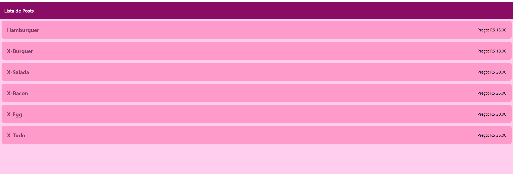
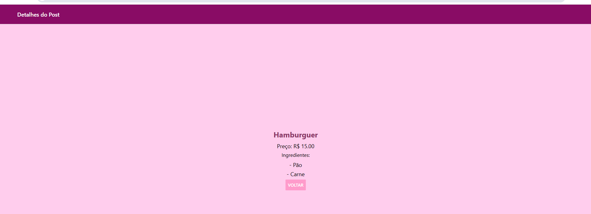

# Lanche👋
- Aplicativo de estudo **Lista** e **detalhes**




## Passos para executar

1. Instale as dependências

   ```bash
   npm install
   ```

2. Inicie o App

   ```bash
   npx expo start
   ```